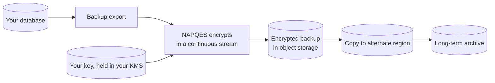
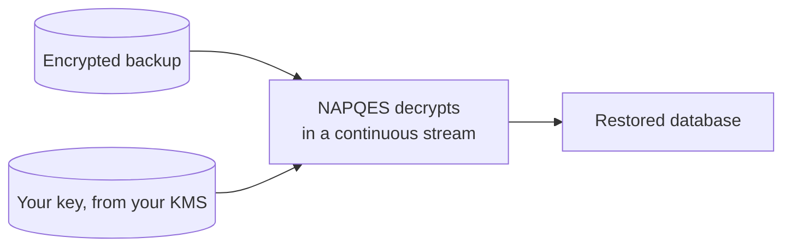
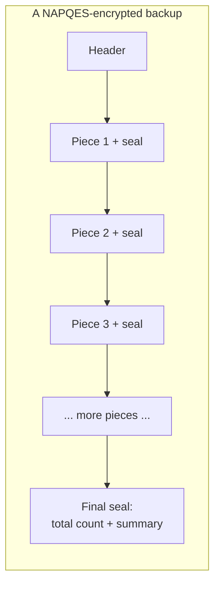
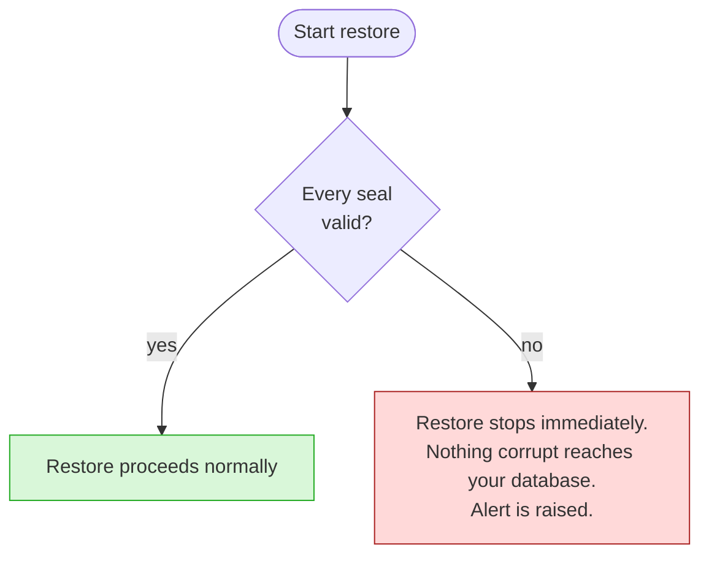
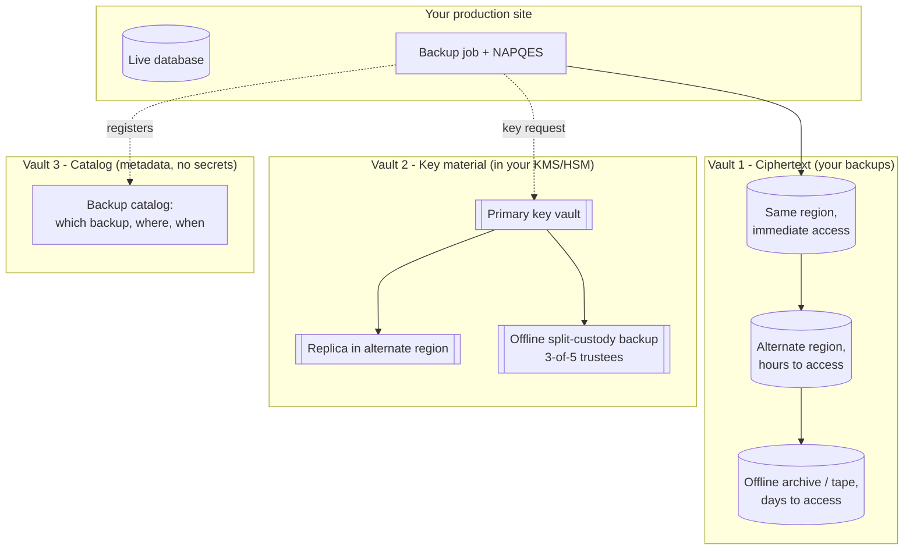
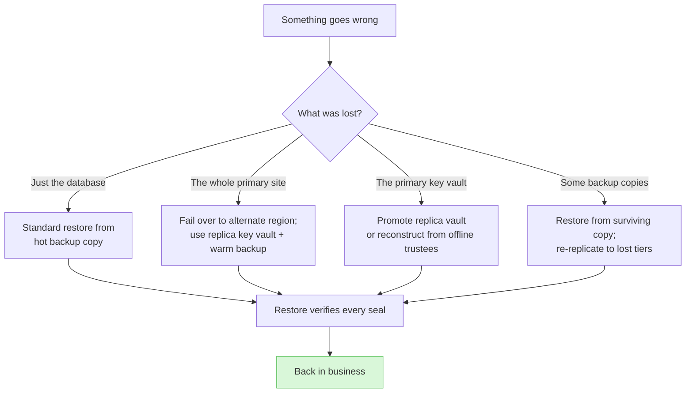

# Protecting Your Database Backups With NAPQES

---

## The Three Questions We Hear Most Often

1. **Can NAPQES actually handle our full database backups - the multi-terabyte ones?**
2. **If a backup file rots on disk, gets tampered with, or is partially lost, will we know before we restore corrupted data into production?**
3. **What does disaster recovery look like once our backups are encrypted with NAPQES - and can we still get our data back if things go wrong?**

Short answer to all three: **yes, and by design.** The rest of this document walks through why.

---

##  The Reassurance in One Sentence

> Your backups stay confidential at rest, any corruption is caught **before** it reaches production, and your recovery plan gets **stronger** - not more fragile - with NAPQES in the loop.

---

## How We Encrypt Backups at Scale

**What actually happens when the backup job runs:**

**What this means for you:**

- **Size is not a constraint.** NAPQES processes the backup in small pieces
  as it flows past. A 10 GB backup and a 10 TB backup use the same amount
  of memory - the difference is just wall-clock time.
- **No "big bang" step.** The backup and the encryption happen together, in
  one pass. Your existing backup window does not need to grow.
- **Runs anywhere.** No special hardware, no dependency on a particular
  chip vendor. Whatever hardware your backup job already runs on, NAPQES
  runs on too.
- **Works with what you have.** Compress first, then encrypt. Your existing
  `pg_dump`, RMAN, mongodump, or filesystem-snapshot pipeline plugs in
  unchanged.

**Restoring is just as simple:**

The restore path is symmetric. The same operator who can run a backup can
run a restore - no extra ceremony.

---

## Why Corrupted Backups Cannot Sneak Through

**The problem NAPQES solves:** In most backup systems, silent corruption - a flipped bit from bit rot, a truncated file from a bad copy, a tampered blob from an insider threat - is only discovered when someone tries to restore. By then, it may be too late.

**What NAPQES does differently:** Every backup carries **two layers of integrity seals** - like tamper-evident tape at multiple points on a shipping container.

- **Every piece is sealed individually.** If a single piece is altered,   bit-rotted, or replaced, its seal will not match and the restore stops on that piece.
- **The final seal counts everything.** If pieces are missing, added, reordered, or if the file was cut short, the final seal will not match.

**At restore time, our decision is deterministic:**

**Two guarantees you can put in front of an auditor or a board:**

1. **No corrupt byte ever reaches your production database.** The decryption engine refuses to hand over data from any piece whose seal fails.
2. **Silent loss is impossible.** A truncated backup, a missing chunk, or a swap of pieces between two backups is detected before you commit anything to the target system.

---

## Backups and Disaster Recovery: Stronger, Not Fragile

A common worry: **"If we encrypt everything with NAPQES, are we now one lost key away from losing all our data?"**

The answer is no - provided you follow a simple three-vault pattern that NAPQES is explicitly designed around.

**The rule:** Ciphertext lives in Vault 1. Keys live in Vault 2. Metadata lives in Vault 3. **No single vault ever holds enough on its own to recover or to leak your data.**

**What this buys you in a disaster:**

**In plain language:**

- **Lose a database?** You have a hot backup in the same region - restore   it. Minutes to hours.
- **Lose the whole site?** Your ciphertext is already replicated to an alternate region, and your key vault has a replica there too. Fail over.
- **Lose your primary key vault?** A replica takes over, or your offline trustees reconstruct the key. Neither event alone loses your data.
- **Lose some backup copies?** As long as one copy of the ciphertext survives - hot, warm, or offline - you restore from it and rebuild the other tiers.
- **The only scenario NAPQES cannot recover from is losing all vaults at once.** That is a business-continuity event, not an encryption problem - and it is the same scenario that would destroy an unencrypted backup archive too.

---

## The Five Operational Rules We Bake Into Your Deployment

We hand these to your ops team as a checklist. Following them keeps the system as strong as the design allows.

| # | Rule | Why it matters to you |
|---|------|-----------------------|
| 1 | Keys never live next to the backups | A single stolen tape or bucket must not be enough to decrypt anything |
| 2 | Every backup gets a fresh unique nonce | Automatic; prevents an entire class of subtle attacks |
| 3 | Old keys are retained as long as their backups are | So you can always restore an old backup, not just recent ones |
| 4 | Restore drills run on a schedule | A backup you have never test-restored is a backup you do not really have |
| 5 | Backup context (source, date, environment) is sealed in | Prevents accidentally restoring the wrong backup into the wrong system |

---

## What to Tell Your Board

Three sentences you can lift verbatim:

> "Our database backups are encrypted with NAPQES, a post-quantum-ready cipher that streams - so backup size is not a constraint and our backup window did not change."

> "Every backup is sealed piece-by-piece plus once at the end, so corruption, truncation, or tampering is detected before any restore touches production."

> "Our disaster-recovery plan separates encrypted backups, key material, and catalog metadata into three independent vaults with their own replication, so no single failure - including loss of the primary key vault - costs us access to our data."
