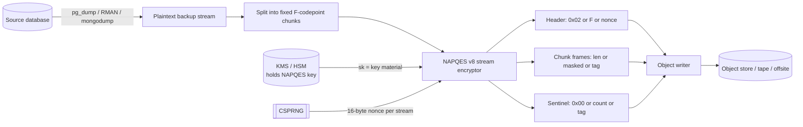
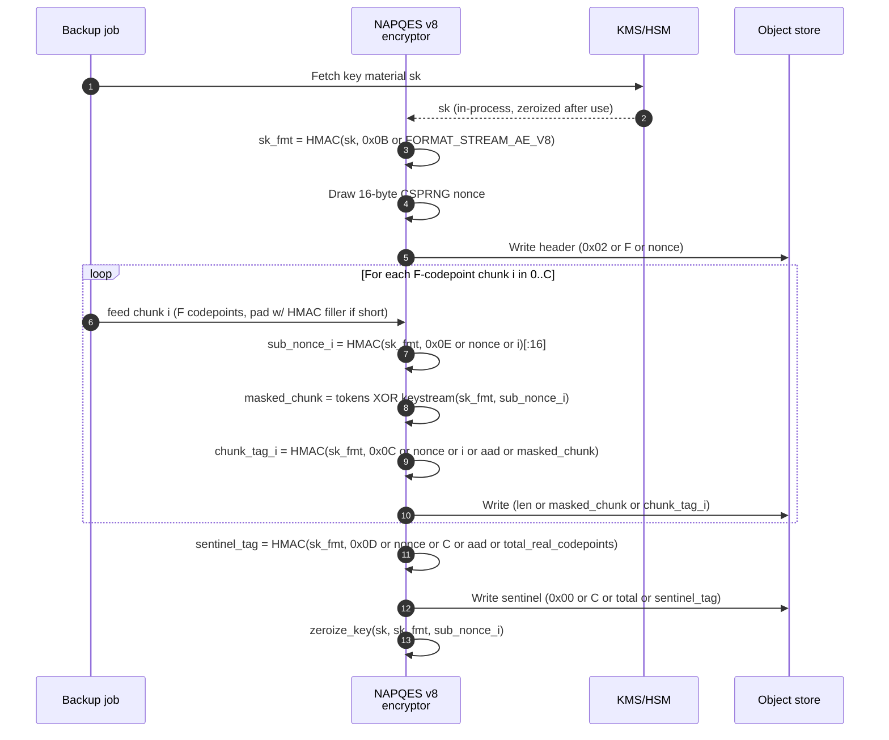
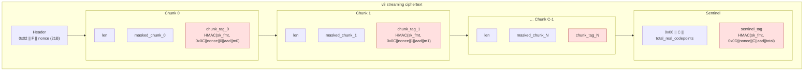
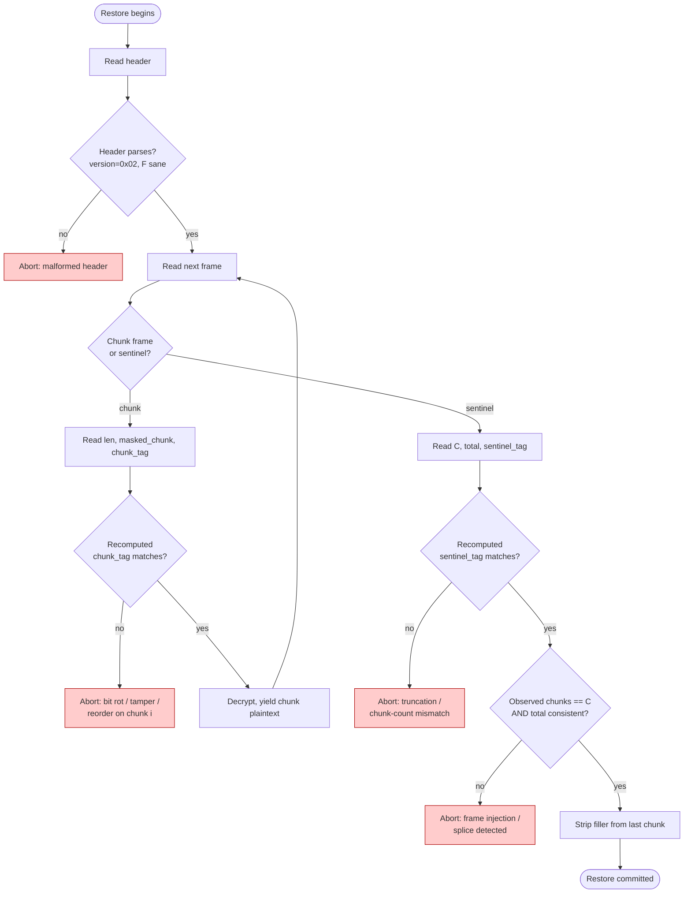
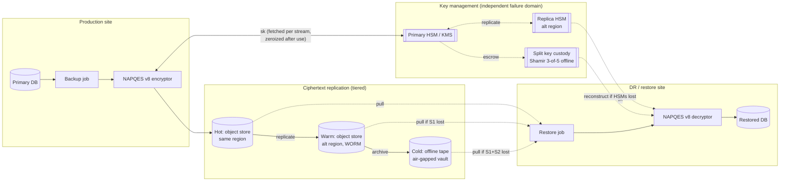
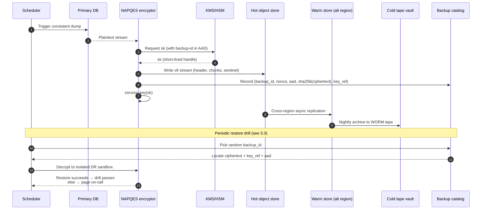
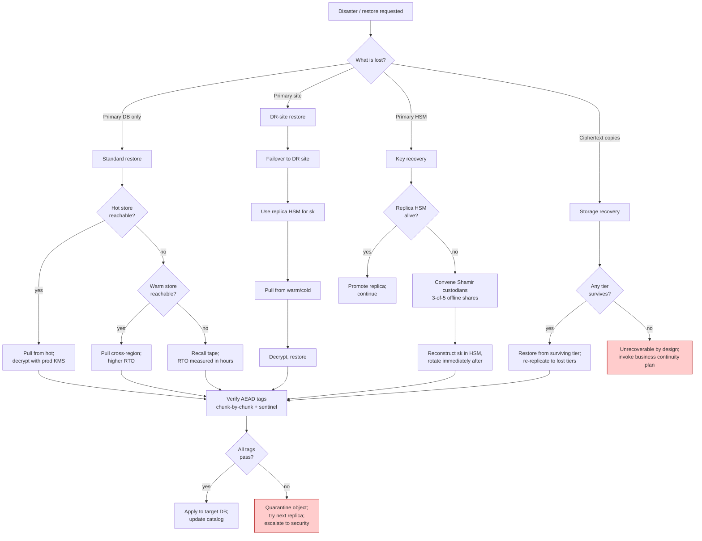

# NAPQES for Database Backups — Encryption, Integrity, and Disaster Recovery

Written for: DBAs, backup engineers, and platform SREs evaluating NAPQES as the
at-rest encryption layer for large database backups.

This document answers three operational questions:

1. How NAPQES encrypts and decrypts large data (e.g. database backups) at scale.
2. How the AEAD construction prevents undetected data corruption.
3. How to structure backups and disaster recovery when NAPQES is the at-rest
   cipher for those backups.

Normative wire-format details are in [SPEC.md](../SPEC.md); this document
summarises the operational picture and cites SPEC sections for depth.

---

## 1. Encryption and decryption at scale (large data / DB backups)

For any input that will not fit comfortably in memory — a full `pg_dump`, an
Oracle RMAN piece, an S3-scale bucket snapshot — the caller MUST use the
**v8 streaming AE format** ([SPEC.md §8.2](../SPEC.md)). Block mode
([SPEC.md §5](../SPEC.md)) has a 65 535-codepoint length cap and is not
appropriate for backup-sized inputs.

### 1.1 High-level dataflow



The producer streams plaintext into the encryptor and streams ciphertext out
to the object store; peak memory is bounded by the chunk parameter `F` (default
128 codepoints per chunk, hard cap 16 384), not by backup size.

### 1.2 Chunk-by-chunk encryption path

Each chunk is encrypted as a self-contained v8 primitive call keyed by
`(sk_fmt, sub_nonce_i)`, where `sk_fmt = HMAC(sk, 0x0B || FORMAT_STREAM_AE_V8)`
and `sub_nonce_i = HMAC(sk_fmt, 0x0E || nonce || uint32_be(i))[:16]`
([SPEC.md §8.2](../SPEC.md)).



**Key sizing choices for backup workloads:**

- **`F` (codepoints per chunk).** Larger `F` amortises per-chunk tag overhead
  (32 B) across more payload. For DB backups, `F = 4096` yields ≈ 655 kB per
  chunk frame with tag overhead ≈ 0.005 %. `F` is public and constant for the
  stream (bound into the header), so per-chunk ciphertext length is a pure
  function of `F` — no length leakage of chunk contents.
- **Parallel producers.** Independent tables/tablespaces can be encrypted as
  independent streams with independent nonces; this parallelises across
  cores without violating the no-nonce-reuse rule.
- **Compression order.** Compress *before* encrypting. Ciphertext is
  effectively random and does not compress; ratio gains must be captured
  upstream (`pg_dump -Z`, `gzip`, `zstd`).

### 1.3 Decryption / restore path

Decryption is symmetric and streams frame by frame. Critically, no plaintext
from chunk `i` is released to the caller until `chunk_tag_i` verifies
([SPEC.md §8.2 "Verify-before-yield"](../SPEC.md)):

```mermaid
sequenceDiagram
    autonumber
    participant Store as Object store
    participant Dec as NAPQES v8<br/>decryptor
    participant KMS as KMS/HSM
    participant DB as Restore target

    Dec->>Store: Read header
    Dec->>Dec: Parse 0x02 or F or nonce; derive sk_fmt
    KMS->>Dec: sk
    loop For each chunk frame i
        Store-->>Dec: (len or masked_chunk or chunk_tag_i)
        Dec->>Dec: Recompute chunk_tag_i'
        alt tag matches
            Dec->>Dec: sub_nonce_i; unmask; decode tokens
            Dec->>DB: yield chunk i plaintext
        else tag mismatch
            Dec->>DB: ABORT restore, raise auth failure
        end
    end
    Store-->>Dec: sentinel (0x00 or C or total or sentinel_tag)
    Dec->>Dec: Verify sentinel_tag (binds C and total_real_codepoints)
    alt sentinel ok
        Dec->>DB: strip filler from last chunk; commit restore
    else sentinel mismatch (truncation or reorder)
        Dec->>DB: ABORT; last chunk's real codepoints NOT emitted
    end
```

The sentinel is the anti-truncation and anti-splice checkpoint: any missing
tail frame, any reordered frame, or any chunk-count mismatch fails
verification and the restore aborts before the final chunk's real codepoints
are delivered.

---

## 2. How AEAD prevents data corruption

NAPQES is authenticated encryption with associated data (AEAD): every
ciphertext carries an HMAC-SHA256 tag over the ciphertext, the nonce, and
any AAD the caller supplied. In v8 streaming mode this is layered — a tag
per chunk plus a sentinel tag binding the chunk count — so corruption is
detected at chunk granularity, not only at end-of-stream.

### 2.1 What "corruption" means here

AEAD detects any change to the ciphertext bytes, the nonce, the AAD, or the
chunk ordering. This covers:

- **Bit rot** on disk / tape / object storage.
- **Truncation** (missing trailing frames or a lost sentinel).
- **Splicing** (frames from one backup grafted into another).
- **Reordering** (frames delivered out of sequence).
- **Active tampering** by an attacker with write access to the backup store.

It does **not** cover: a database-level corruption that was already present
in the plaintext before encryption (NAPQES faithfully encrypts whatever it
receives), nor a lost key (which is an availability problem, addressed in §3).

### 2.2 Tag structure and what each tag binds



Each tag is a keyed HMAC over inputs the attacker cannot forge without the
key material:

| Tag | Domain | Binds |
|---|---|---|
| `chunk_tag_i` | `0x0C` | `sk_fmt`, `nonce`, chunk index `i`, AAD, `masked_chunk_i` |
| `sentinel_tag` | `0x0D` | `sk_fmt`, `nonce`, chunk count `C`, AAD, `total_real_codepoints` |

Because the chunk index is bound into every chunk tag, swapping two
otherwise-valid chunks produces two tag mismatches. Because `C` and the
real-codepoint count are bound into the sentinel, truncating the stream at a
chunk boundary is detected even if the remaining chunk tags are all valid.

### 2.3 Corruption detection decision flow (restore-time)



Every failure path aborts the restore *before* any of the corrupt chunk's
plaintext reaches the target database. This is the RUP (release of
unverified plaintext) fix from CAV-001 ([SPEC.md §8.2, "Verify-before-yield"](../SPEC.md)),
and it is why the deprecated basic streaming format (§8) is forbidden for
new ciphertext ([SPEC.md §8, CVF7 fix](../SPEC.md)).

### 2.4 AAD as a binding contract

The AAD field is the operator's lever for **domain-binding** a backup to its
intended context. Anything put into AAD is authenticated but not encrypted,
so the caller can bind:

- Backup ID / timestamp (prevents replaying an old backup as a new one).
- Source database identity (prevents cross-restore into the wrong instance).
- Retention class / environment label (prevents prod backup landing in dev).

At restore time, the *same* AAD must be supplied; a mismatch fails every
tag. This turns AAD into a lightweight contract that the restore path
enforces cryptographically.

---

## 3. Backup and disaster recovery with NAPQES-encrypted DB backups

NAPQES protects the confidentiality and integrity of the backup blob. It does
not, on its own, provide the *availability* half of DR — that comes from
where and how the ciphertext and key material are stored. The pattern below
separates the two concerns.

### 3.1 Reference topology



Three independent failure domains — **ciphertext**, **key material**, and
**operational metadata** — each need their own DR story. Losing any one
must still leave a survivable path; losing two is a designed-for degraded
mode; losing all three is unrecoverable by construction (that is the
security property, not a bug).

### 3.2 Backup lifecycle timeline



**Catalog contents.** The backup catalog is the third failure domain. It
holds *metadata about* backups — never key material, never plaintext — and
must itself be replicated. At minimum per backup: `backup_id`, source DB
identity, ciphertext location(s), the nonce (public), the AAD used, a
plaintext-independent integrity hash of the ciphertext object, and an
opaque `key_ref` the KMS can resolve.

### 3.3 Restore / disaster recovery decision path



### 3.4 Operational rules that make this actually work

- **Never store `sk` next to the ciphertext.** The whole design collapses
  if a single stolen tape or bucket contains both. Key material lives only
  in the KMS/HSM and its offline escrow.
- **Nonce uniqueness is non-negotiable.** v8 streaming is not
  misuse-resistant ([CAV-005 in SPEC.md §8.2](../SPEC.md)); nonce reuse
  across two streams under the same `sk` is catastrophic. Use the
  CSPRNG-drawn 16-byte nonce per stream — do not derive it from the
  backup ID or timestamp.
- **Key rotation ≠ ciphertext re-encryption.** Rotating `sk` in the KMS
  does not invalidate historical ciphertexts encrypted under the previous
  `sk`; retain retired keys in the KMS for the ciphertext retention
  window, or re-encrypt on rotation.
- **Restore drills verify AEAD.** A restore that never runs is a backup
  that does not exist. Schedule periodic drills that decrypt to an
  isolated sandbox; any tag failure surfaces silent corruption before an
  incident does.
- **Bind context into AAD.** Backup ID, source DB identity, environment,
  and retention class all belong in AAD so the restore path cannot
  accidentally cross-wire a backup into the wrong target. See §2.4.
- **Zeroize on the hot path.** `zeroize_key()` runs after every stream on
  both encrypt and decrypt sides ([project_fips140.md](../../MEMORY.md)
  Phase 3 work in the Rust core); do not let `sk` linger in a long-running
  process's heap.

---

## References

- [SPEC.md §5](../SPEC.md) — Block ciphertext wire format (v7).
- [SPEC.md §8.1](../SPEC.md) — v6s-ae streaming AE (per-chunk tags, sentinel).
- [SPEC.md §8.2](../SPEC.md) — v8 streaming AE (fixed-width tokens, per-chunk padding).
- [docs/CAVEATS.md](CAVEATS.md) — CAV-001 (RUP), CAV-005 (v8 nonce reuse).
- [docs/fips/KEY_MANAGEMENT.md](fips/KEY_MANAGEMENT.md) — Key lifecycle for FIPS 140-3 module boundary.
